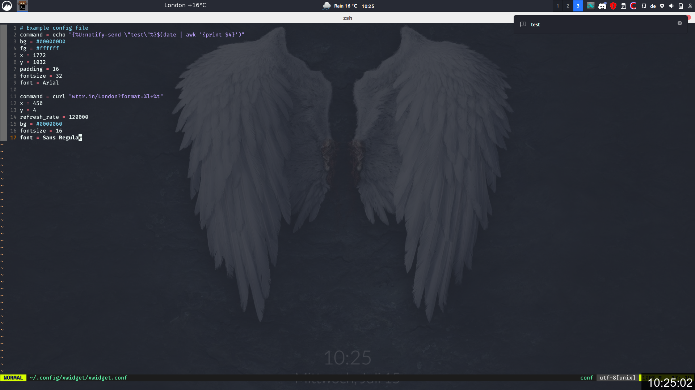

# xwidget

simple xorg widgets


## Examples

### Example 1

- Showing the current weather in the top middle

- Displaying the current time in the bottom right corner

- Running `notify-send "test"` when scrolling up on the time

- Example config can be seen in the screenshot



### Example 2

- toggle a hud via `sxhkd`

- Create a hotkey, which runs `xwidget` and optionally set a different config file

## Installation

- clone / download the repository

- optional: build the program: `make`

- copy the `./xwidget` file into your bin

- e.g.: `sudo cp xwidget /bin/`

## Config file

- After running the program once, the file `~/.config/xwidget/xwidget.conf` should exist
- Edit the config file above to define widgets
- Comments start with a `#` or `;`
- Empty lines separate widgets
- In each widget section the following can be defined
  - `command`
  - `x` position
  - `y` position
  - `w` minimum width
  - `h` minimum height
  - `font`
  - `fontsize`
  - `bg` background color
  - `fg` foreground color
  - `padding` in pixel
  - `line_height`
  - `refresh_rate` in milliseconds
- Colors can be defined as an argb or rgb hexcode, e.g.: `#000000` or `#FF000080`
- Define the attributes of each widget in the following way:  `key = value`; the whitespace between the `=` is mandatory

## Run modes

- `-c` / `--config` to specify the config; will default to `~/.config/xwidget/xwidget.conf`
- `-p` / `--print`  will exit with 0, if an instance with the same config exists, 1 if an instance does not exist
- `-r` / `--reload` reloads the instance with the specified config
- `-t` / `--timeout` will timeout after x seconds and kill itself
- no options        will kill the instance with the config, if it exists, else it will start (can be used to toggle the program via commandline)

## Commands

- Commands define `areas` inside of the widget, which are to be rendered
- Areas are automatically created on a newline
- Each area has attributes, which are inherited from the widget
  - `B` background color
  - `F` foreground color
  - `X` x position: -1 to center; -2 to align to the right side 
  - `Y` y position: -1 to center; -2 to align to the bottom side
  - `W` minimum width
  - `H` minimum height
  - `P` padding
  - `S` font size 
  - `I` sets the area type to `image`: the content now should be an URL to a .png file
  - The following actions, which are triggered on the respective event:
  - `L` mouse button 1 (left click);
  - `M` mouse button 2 (middle click)
  - `R` mouse button 3 (right click)
  - `U` mouse button 4 (scroll up)
  - `D` mouse button 5 (scroll down)
- Inside of the command result, area attributes can be changed via the `` syntax
- `` will reset the attributes of the following areas to the attributes of the parent
- ``  / `{%key:value%key:value%}` / `{%key:value%...%}`
- attributes can be changed in the above way; the key is the highlighted character from the list above, value can be a color, number, string, ...

```
command = echo "This is a test"
x = 200
y = 200
fontsize = 22
```

Will create a widget with the text "This is a test". After clicking on it, a notification with the message "Test" should be displayed.

## FAQ

- Program is stuck / won't start
  - navigate to `/tmp/` and remove all files, which start with `xwidget` and end with some numbers
  - please don't kill this program <3
